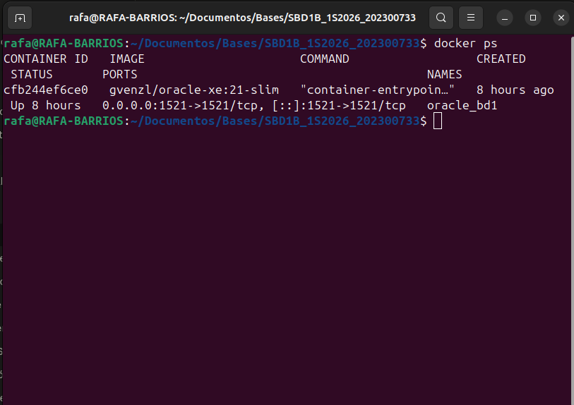
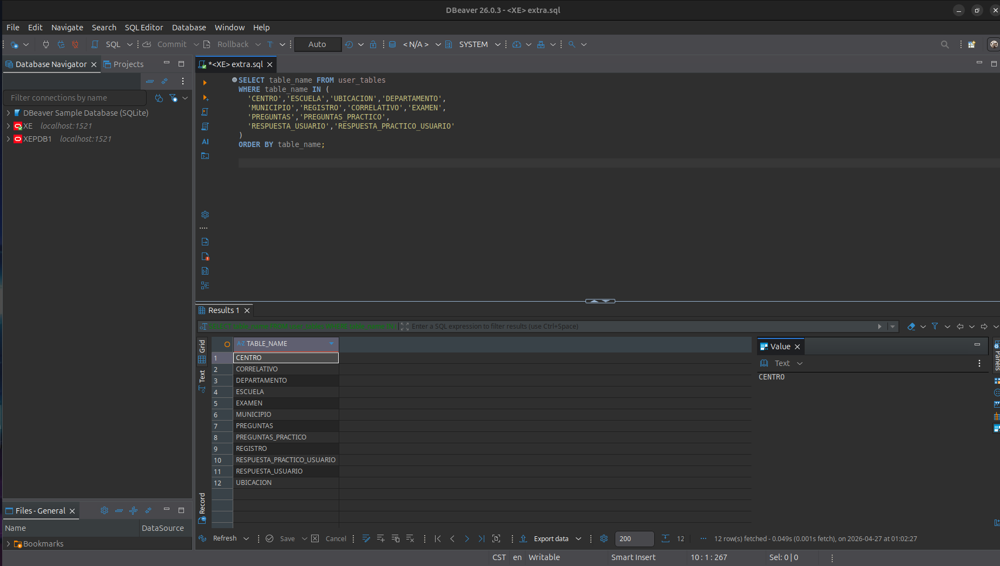
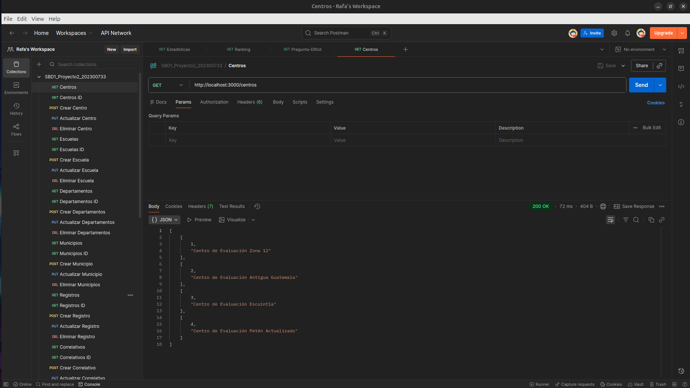
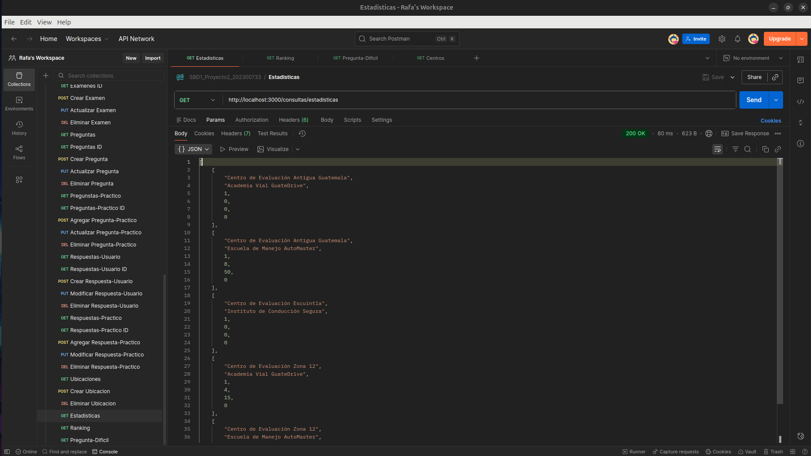

# Proyecto 2

**Universidad San Carlos de Guatemala**  
**Estudiante:** Angel Rafael Barrios González  
**Carnet:** 202300733  
**Laboratorio:** Bases de Datos 1  
**Sección:** B  

---

## Backend y Exposición de Servicios para la Base de Datos "Centros de Evaluación de Manejo"

---

## 📋 Descripción del Proyecto

Este proyecto implementa una arquitectura de servicios moderna para el sistema de gestión de los Centros de Evaluación de Manejo de Guatemala. El sistema transforma una base de datos estática en un ecosistema funcional que garantiza portabilidad y seguridad en el acceso a la información.

La solución está compuesta por:

- Una base de datos **Oracle XE 21c** completamente dockerizada que se inicializa automáticamente al levantar el contenedor
- Un **API REST** desarrollada en Node.js con el framework Express que expone todos los datos del modelo relacional
- **12 tablas** con operaciones CRUD completas accesibles mediante endpoints HTTP
- **3 consultas estadísticas** especiales para análisis de evaluaciones

---

## 🗂️ Estructura del Proyecto

```
SBD1B_1S2026_202300733/
├── api/
│   ├── routes/
│   │   ├── centros.js
│   │   ├── escuelas.js
│   │   ├── ubicaciones.js
│   │   ├── departamentos.js
│   │   ├── municipios.js
│   │   ├── registros.js
│   │   ├── correlativos.js
│   │   ├── examenes.js
│   │   ├── preguntas.js
│   │   ├── preguntasPractico.js
│   │   ├── respuestasUsuario.js
│   │   ├── respuestasPractico.js
│   │   └── consultas.js
│   ├── .env
│   ├── db.js
│   ├── index.js
│   ├── package.json
│   └── package-lock.json
├── init/
│   ├── DDL.sql
│   └── DML.sql
├── img/
│   ├── docker.png
│   ├── dbeaver.png
│   ├── postman_crud.png
│   └── consultas.png
├── docker-compose.yml
├── SBD1_Proyecto2_202300733.postman_collection.json
└── README.md
```

---

## 🛠️ Tecnologías Utilizadas

| Herramienta | Versión | Uso |
|---|---|---|
| Docker & Docker Compose | Latest | Contenerización de Oracle XE |
| Oracle Database XE | 21c | Motor de base de datos relacional |
| Node.js | 18 LTS | Entorno de ejecución del servidor |
| Express | 4.x | Framework para la API REST |
| DBeaver | 26.x | Administración visual de la base de datos |
| Postman | Latest | Pruebas y documentación de endpoints |
| Git & GitHub | Latest | Control de versiones |

---

## 🚀 Guía de Despliegue con Docker

### Requisitos Previos

Antes de ejecutar el proyecto asegúrese de tener instalado:
- Docker y Docker Compose
- Node.js 18 o superior
- Git

### Paso 1 — Clonar el Repositorio

```bash
git clone https://github.com/tu_usuario/SBD1B_1S2026_202300733.git
cd SBD1B_1S2026_202300733
```

### Paso 2 — Levantar Oracle con Docker

```bash
docker compose up -d
```

Este único comando realiza automáticamente todo lo siguiente:
- Descarga la imagen de Oracle XE 21c
- Crea y levanta el contenedor con el nombre `oracle_bd1`
- Ejecuta el archivo `DDL.sql` creando las 12 tablas y 8 foreign keys
- Ejecuta el archivo `DML.sql` cargando todos los datos de prueba
- Persiste los datos en un volumen Docker

> **Nota:** La primera vez puede tardar 3-5 minutos mientras Oracle se inicializa. Las siguientes veces arranca en segundos.

### Paso 3 — Verificar que Oracle está Corriendo

```bash
docker ps
```

Debe aparecer el contenedor `oracle_bd1` en estado `Up`.

Para ver los logs de inicialización:

```bash
docker logs -f oracle_bd1
```

Cuando aparezca `DATABASE IS READY TO USE` la base de datos está lista.

### Paso 4 — Instalar Dependencias de la API

```bash
cd api
npm install
```

### Paso 5 — Levantar el Servidor API

```bash
node index.js
```

El servidor estará disponible en: `http://localhost:3000`

Debe aparecer el mensaje: `Servidor corriendo en http://localhost:3000`

### Paso 6 — Apagar el Sistema

```bash
# Detener el servidor API: Ctrl+C en la terminal del servidor

# Apagar Docker conservando los datos:
docker compose down
```

> **Importante:** Usar `docker compose down` sin `-v` conserva todos los datos. Solo usar `docker compose down -v` si se desea resetear completamente la base de datos.

---

## 🔌 Conexión desde DBeaver

### Datos de Conexión

| Campo | Valor |
|---|---|
| Host | localhost |
| Port | 1521 |
| Database | XE |
| Username | SYSTEM |
| Password | admin1234 |
| Role | Normal |

### Pasos para Conectarse

1. Abrir DBeaver
2. Ir al menú **Database → New Database Connection**
3. Seleccionar **Oracle** y dar clic en **Next**
4. Llenar los datos de la tabla anterior exactamente como se muestran
5. La primera vez descargará el driver de Oracle automáticamente, aceptar
6. Dar clic en **"Test Connection"** — debe mostrar **Connected**
7. Dar clic en **Finish**

### Verificar las Tablas en DBeaver

Una vez conectado, abrir el editor SQL y ejecutar:

```sql
SELECT table_name FROM user_tables 
WHERE table_name IN (
  'CENTRO','ESCUELA','UBICACION','DEPARTAMENTO',
  'MUNICIPIO','REGISTRO','CORRELATIVO','EXAMEN',
  'PREGUNTAS','PREGUNTAS_PRACTICO',
  'RESPUESTA_USUARIO','RESPUESTA_PRACTICO_USUARIO'
)
ORDER BY table_name;
```

Debe devolver exactamente 12 filas.

Para verificar las Foreign Keys:

```sql
SELECT constraint_name, table_name, status
FROM user_constraints
WHERE constraint_type = 'R'
  AND constraint_name IN (
    'FK_UBICACION_ESCUELA','FK_UBICACION_CENTRO',
    'FK_REG_ESCUELA','FK_REG_CENTRO',
    'FK_EXAMEN_REGISTRO','FK_EXAMEN_CORRELATIVO',
    'FK_RESP_EXAMEN','FK_RESPPRAC_EXAMEN'
  )
ORDER BY table_name;
```

Debe devolver 8 filas todas en estado **ENABLED**.

---

## 🌐 Endpoints de la API

El servidor corre en `http://localhost:3000`

### CRUD de Tablas

#### CENTROS
| Método | Endpoint | Descripción |
|---|---|---|
| GET | /centros | Obtener todos los centros |
| GET | /centros/:id | Obtener un centro por ID |
| POST | /centros | Crear un nuevo centro |
| PUT | /centros/:id | Actualizar un centro |
| DELETE | /centros/:id | Eliminar un centro |

**Body POST/PUT:**
```json
{
    "id_centro": 4,
    "nombre": "Centro de Evaluación Petén"
}
```

---

#### ESCUELAS
| Método | Endpoint | Descripción |
|---|---|---|
| GET | /escuelas | Obtener todas las escuelas |
| GET | /escuelas/:id | Obtener una escuela por ID |
| POST | /escuelas | Crear una nueva escuela |
| PUT | /escuelas/:id | Actualizar una escuela |
| DELETE | /escuelas/:id | Eliminar una escuela |

**Body POST/PUT:**
```json
{
    "id_escuela": 4,
    "nombre": "Escuela de Manejo RapidDrive",
    "direccion": "Zona 15, Vista Hermosa",
    "acuerdo": "ESC-RD-004"
}
```

---

#### DEPARTAMENTOS
| Método | Endpoint | Descripción |
|---|---|---|
| GET | /departamentos | Obtener todos los departamentos |
| GET | /departamentos/:id | Obtener un departamento por ID |
| POST | /departamentos | Crear un nuevo departamento |
| PUT | /departamentos/:id | Actualizar un departamento |
| DELETE | /departamentos/:id | Eliminar un departamento |

**Body POST/PUT:**
```json
{
    "id_departamento": 4,
    "nombre": "Quetzaltenango",
    "codigo": 9
}
```

---

#### MUNICIPIOS
| Método | Endpoint | Descripción |
|---|---|---|
| GET | /municipios | Obtener todos los municipios |
| GET | /municipios/:id | Obtener un municipio por ID |
| POST | /municipios | Crear un nuevo municipio |
| PUT | /municipios/:id | Actualizar un municipio |
| DELETE | /municipios/:id | Eliminar un municipio |

**Body POST/PUT:**
```json
{
    "id_municipio": 6,
    "departamento_id_departamento": 1,
    "nombre": "San Miguel Petapa",
    "codigo": 6
}
```

---

#### UBICACIONES
| Método | Endpoint | Descripción |
|---|---|---|
| GET | /ubicaciones | Obtener todas las ubicaciones |
| POST | /ubicaciones | Crear una nueva ubicación |
| DELETE | /ubicaciones | Eliminar una ubicación |

> Ubicaciones no tiene GET por ID ni PUT porque su clave primaria es compuesta (escuela + centro).

**Body POST/DELETE:**
```json
{
    "escuela_id_escuela": 2,
    "centro_id_centro": 3
}
```

---

#### REGISTROS
| Método | Endpoint | Descripción |
|---|---|---|
| GET | /registros | Obtener todos los registros |
| GET | /registros/:id | Obtener un registro por ID |
| POST | /registros | Crear un nuevo registro |
| PUT | /registros/:id | Actualizar un registro |
| DELETE | /registros/:id | Eliminar un registro |

**Body POST:**
```json
{
    "id_registro": 6,
    "ubicacion_escuela_id_escuela": 1,
    "ubicacion_centro_id_centro": 1,
    "municipio_id_municipio": 1,
    "municipio_departamento_id_departamento": 1,
    "fecha": "2025-02-01",
    "tipo_tramite": "Primera Licencia",
    "tipo_licencia": "B",
    "nombre_completo": "Luis Fernando Pérez",
    "genero": "M"
}
```

---

#### CORRELATIVOS
| Método | Endpoint | Descripción |
|---|---|---|
| GET | /correlativos | Obtener todos los correlativos |
| GET | /correlativos/:id | Obtener un correlativo por ID |
| POST | /correlativos | Crear un nuevo correlativo |
| PUT | /correlativos/:id | Actualizar un correlativo |
| DELETE | /correlativos/:id | Eliminar un correlativo |

**Body POST:**
```json
{
    "id_correlativo": 6,
    "fecha": "2025-02-01",
    "no_examen": 1
}
```

---

#### EXAMENES
| Método | Endpoint | Descripción |
|---|---|---|
| GET | /examenes | Obtener todos los exámenes |
| GET | /examenes/:id | Obtener un examen por ID |
| POST | /examenes | Crear un nuevo examen |
| PUT | /examenes/:id | Actualizar un examen |
| DELETE | /examenes/:id | Eliminar un examen |

**Body POST:**
```json
{
    "id_examen": 6,
    "registro_id_escuela": 1,
    "registro_id_centro": 1,
    "registro_municipio_id_municipio": 1,
    "registro_municipio_departamento_id_departamento": 1,
    "registro_id_registro": 1,
    "correlativo_id_correlativo": 1
}
```

---

#### PREGUNTAS TEÓRICAS
| Método | Endpoint | Descripción |
|---|---|---|
| GET | /preguntas | Obtener todas las preguntas |
| GET | /preguntas/:id | Obtener una pregunta por ID |
| POST | /preguntas | Crear una nueva pregunta |
| PUT | /preguntas/:id | Actualizar una pregunta |
| DELETE | /preguntas/:id | Eliminar una pregunta |

**Body POST:**
```json
{
    "id_pregunta": 5,
    "pregunta_texto": "¿Qué color tiene la luz de alto?",
    "respuesta": "A",
    "res1": "Rojo",
    "res2": "Verde",
    "res3": "Amarillo",
    "res4": "Azul"
}
```

---

#### PREGUNTAS PRÁCTICAS
| Método | Endpoint | Descripción |
|---|---|---|
| GET | /preguntas-practico | Obtener todas las preguntas prácticas |
| GET | /preguntas-practico/:id | Obtener una pregunta práctica por ID |
| POST | /preguntas-practico | Crear una nueva pregunta práctica |
| PUT | /preguntas-practico/:id | Actualizar una pregunta práctica |
| DELETE | /preguntas-practico/:id | Eliminar una pregunta práctica |

**Body POST:**
```json
{
    "id_pregunta_practico": 5,
    "pregunta_texto": "Conducir en carretera a velocidad constante",
    "punteo": 20
}
```

---

#### RESPUESTAS TEÓRICAS USUARIO
| Método | Endpoint | Descripción |
|---|---|---|
| GET | /respuestas-usuario | Obtener todas las respuestas |
| GET | /respuestas-usuario/:id | Obtener una respuesta por ID |
| POST | /respuestas-usuario | Crear una nueva respuesta |
| PUT | /respuestas-usuario/:id | Actualizar una respuesta |
| DELETE | /respuestas-usuario/:id | Eliminar una respuesta |

**Body POST:**
```json
{
    "id_respuesta_usuario": 7,
    "pregunta_id_pregunta": 1,
    "examen_id_examen": 4,
    "respuesta": "A"
}
```

---

#### RESPUESTAS PRÁCTICAS USUARIO
| Método | Endpoint | Descripción |
|---|---|---|
| GET | /respuestas-practico | Obtener todas las respuestas prácticas |
| GET | /respuestas-practico/:id | Obtener una respuesta práctica por ID |
| POST | /respuestas-practico | Crear una nueva respuesta práctica |
| PUT | /respuestas-practico/:id | Actualizar una respuesta práctica |
| DELETE | /respuestas-practico/:id | Eliminar una respuesta práctica |

**Body POST:**
```json
{
    "id_respuesta_practico": 6,
    "pregunta_practico_id_pregunta_practico": 1,
    "examen_id_examen": 4,
    "nota": 17
}
```

---

### 📊 Consultas Estadísticas

#### Consulta 1 — Estadísticas por Centro y Escuela
```
GET http://localhost:3000/consultas/estadisticas
```

Muestra por cada combinación de centro y escuela:
- Nombre del Centro
- Nombre de la Escuela
- Total de exámenes realizados
- Promedio del examen teórico
- Promedio del examen práctico
- Cantidad de aprobados

> Un evaluado se considera **APROBADO** cuando obtiene 70 puntos o más tanto en el examen teórico como en el práctico.

---

#### Consulta 2 — Ranking de Evaluados
```
GET http://localhost:3000/consultas/ranking
```

Muestra todos los evaluados ordenados de mayor a menor puntaje:
- Posición en el ranking
- Nombre completo del evaluado
- Tipo de licencia solicitada
- Nota teórica obtenida
- Nota práctica obtenida
- Puntaje total
- Resultado (APROBADO / REPROBADO)

---

#### Consulta 3 — Pregunta con Menor Porcentaje de Aciertos
```
GET http://localhost:3000/consultas/pregunta-dificil
```

Identifica la pregunta teórica más difícil mostrando:
- ID de la pregunta
- Texto de la pregunta
- Total de veces que fue respondida
- Cantidad de aciertos
- Porcentaje de aciertos (%)

---

## 📸 Evidencias de Funcionamiento

### Docker corriendo correctamente


### DBeaver conectado con las tablas visibles


### Postman — Endpoint CRUD funcionando


### Postman — Consultas estadísticas con resultados


---

## ⚙️ Variables de Entorno

El proyecto usa un archivo `.env` para manejar las credenciales de forma segura:

```
DB_USER=SYSTEM
DB_PASSWORD=admin1234
DB_HOST=localhost
DB_PORT=1521
DB_SERVICE=XE
PORT=3000
```

---

## 📁 Archivos Importantes

| Archivo | Descripción |
|---|---|
| `docker-compose.yml` | Configuración del contenedor Oracle XE |
| `init/DDL.sql` | Script que crea las 12 tablas y 8 foreign keys |
| `init/DML.sql` | Script que carga los datos de prueba |
| `api/db.js` | Módulo de conexión a Oracle |
| `api/index.js` | Servidor principal Express |
| `SBD1_Proyecto2_202300733.postman_collection.json` | Colección de Postman con todos los endpoints |